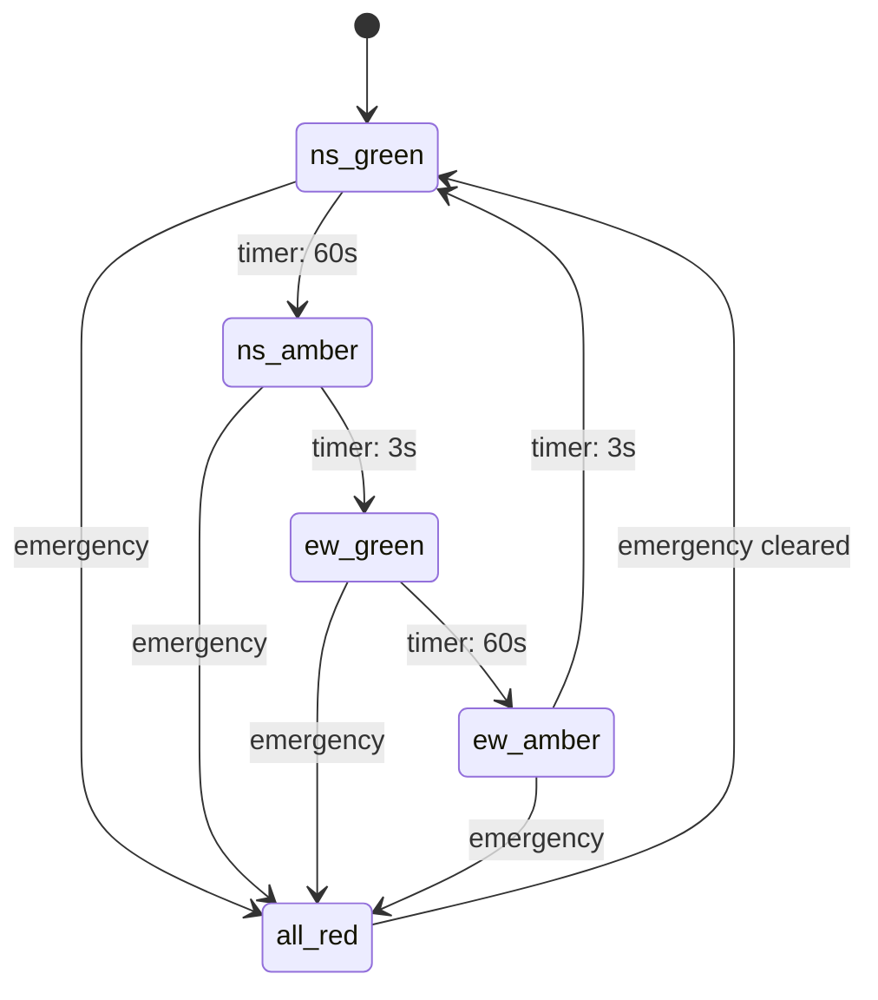

# Traffic Light FSM
## State Diagram

```mermaid
stateDiagram-v2

[*] --> ns_green

ns_green --> ns_amber: timer: 60s
ns_amber --> ew_green: timer: 3s
ew_green --> ew_amber: timer: 60s
ew_amber --> ns_green: timer: 3s

ns_green --> all_red: emergency
ns_amber --> all_red: emergency
ew_green --> all_red: emergency
ew_amber --> all_red: emergency

all_red --> ns_green: emergency cleared
```

## Description
This project implements a traffic light controller using a finite state machine
