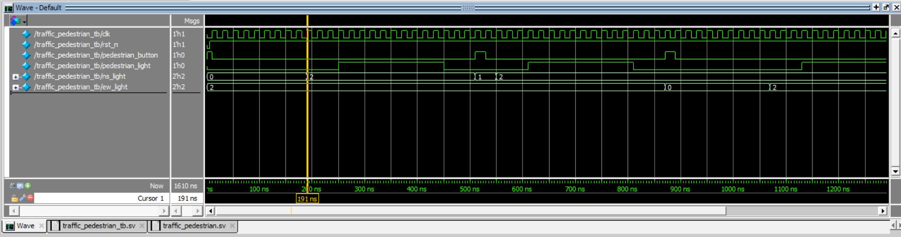
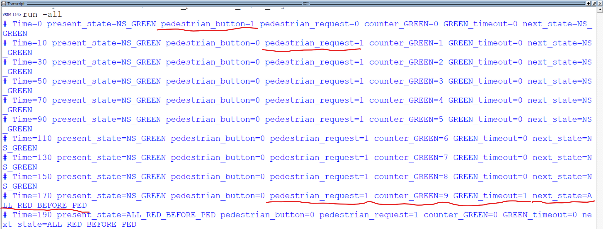
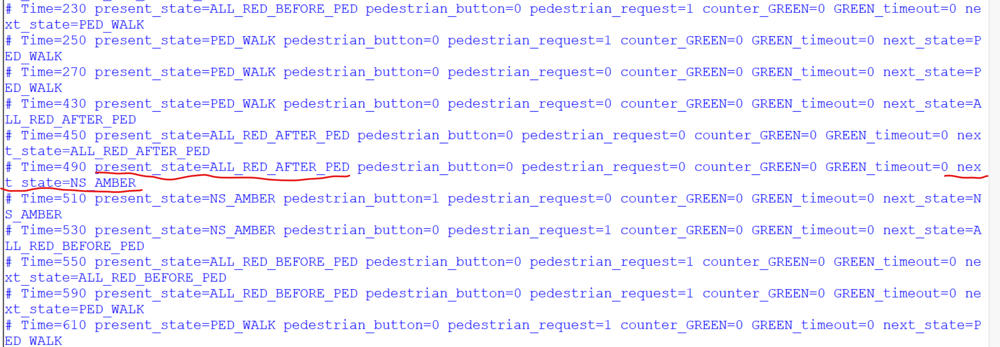
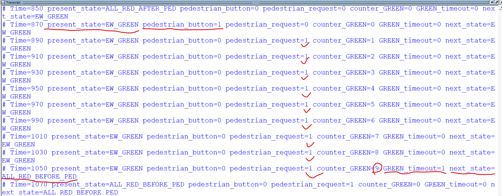

# Traffic Light FSM with Pedestrian Request
## State Diagram

```mermaid
stateDiagram-v2

[*] --> NS_GREEN

NS_GREEN --> NS_AMBER: timer_10
NS_AMBER --> EW_GREEN: timer_3
EW_GREEN --> EW_AMBER: timer_10
EW_AMBER --> NS_GREEN: timer_3

NS_GREEN --> Pedestrian_request --> GREEN_timeout --> ALL_RED_BEFORE_PED
NS_AMBER --> Pedestrian_request --> ALL_RED_BEFORE_PED
EW_GREEN --> Pedestrian_request --> GREEN_timeout --> ALL_RED_BEFORE_PED
EW_AMBER --> Pedestrian_request --> ALL_RED_BEFORE_PED

ALL_RED_BEFORE_PED --> PED_WALK --> ALL_RED_AFTER_PED
```

## Description
This project implements a traffic light controller with pedestrian request.

## Simulation Waveform


## Monitor Result



