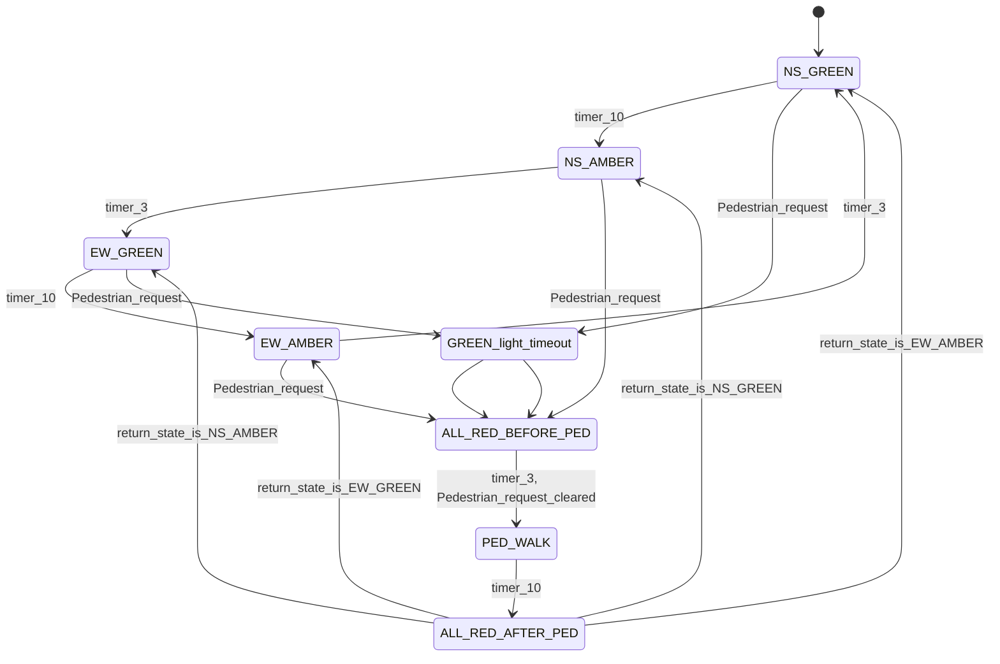

# Traffic Light FSM with Pedestrian Request
## State Diagram

```mermaid
stateDiagram-v2

[*] --> NS_GREEN

NS_GREEN --> NS_AMBER: timer_10
NS_AMBER --> EW_GREEN: timer_3
EW_GREEN --> EW_AMBER: timer_10
EW_AMBER --> NS_GREEN: timer_3

NS_GREEN --> GREEN_light_timeout: Pedestrian_request
GREEN_light_timeout --> ALL_RED_BEFORE_PED

NS_AMBER --> ALL_RED_BEFORE_PED: Pedestrian_request

EW_GREEN --> GREEN_light_timeout: Pedestrian_request
GREEN_light_timeout --> ALL_RED_BEFORE_PED

EW_AMBER --> ALL_RED_BEFORE_PED: Pedestrian_request

ALL_RED_BEFORE_PED --> PED_WALK: timer_3, Pedestrian_request_cleared
PED_WALK --> ALL_RED_AFTER_PED: timer_10

ALL_RED_AFTER_PED --> NS_GREEN: return_state_is_EW_AMBER
ALL_RED_AFTER_PED --> NS_AMBER: return_state_is_NS_GREEN
ALL_RED_AFTER_PED --> EW_GREEN: return_state_is_NS_AMBER
ALL_RED_AFTER_PED --> EW_AMBER: return_state_is_EW_GREEN

```

## Description
This project implements a traffic light controller with pedestrian request.

## Simulation Waveform

## Monitor Result

